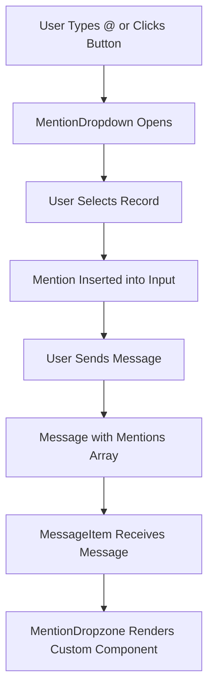

# Design Document

## Overview

This design implements an @mention system for the WeWeb chat component that allows users to reference records (tasks, projects, contacts, etc.) within messages. The system consists of three main parts:

1. **Mention Input System**: A button and automatic detection mechanism that triggers a dropdown selector
2. **Mention Dropdown**: A tabbed interface for browsing and selecting records to mention
3. **Message Rendering System**: Dropzones within message bubbles that allow custom WeWeb components to render mentioned records

The design follows WeWeb's custom element patterns, using bindable properties for data configuration and dropzones for flexible rendering.

## Architecture

### Component Structure

```
wwElement.vue (Main Chat Component)
├── ChatHeader.vue
├── MessageList.vue
│   └── MessageItem.vue
│       └── MentionDropzone.vue (NEW)
└── InputArea.vue
    ├── MentionButton.vue (NEW)
    └── MentionDropdown.vue (NEW)
```

### Data Flow



### State Management

The mention system will use Vue 3 composition API with the following reactive state:

- `mentionDropdownVisible`: Boolean controlling dropdown visibility
- `mentionDropdownPosition`: Object with x, y coordinates for positioning
- `activeMentionTab`: String ID of currently selected record type tab
- `mentionFilterText`: String for filtering records in dropdown
- `highlightedRecordIndex`: Number for keyboard navigation
- `pendingMentionPosition`: Number representing cursor position for mention insertion

## Components and Interfaces

### 1. MentionButton Component

**Purpose**: Provides a clickable button to trigger the mention dropdown

**Props**:
- `isDisabled`: Boolean
- `mentionIcon`: String (icon identifier)
- `mentionIconColor`: String (CSS color)
- `mentionIconSize`: String (CSS size)
- `mentionButtonBgColor`: String (CSS color)
- `mentionButtonHoverBgColor`: String (CSS color)
- `mentionButtonBorder`: String (CSS border)
- `mentionButtonBorderRadius`: String (CSS border-radius)
- `mentionButtonSize`: String (CSS size)
- `mentionButtonBoxShadow`: String (CSS box-shadow)

**Events**:
- `click`: Emitted when button is clicked

**Template Structure**:
```vue
<button
  class="ww-chat-input-area__mention-btn"
  :style="mentionButtonStyle"
  @click="handleClick"
  :disabled="isDisabled"
>
  <span class="ww-chat-input-area__icon" v-html="mentionIconHtml"></span>
</button>
```

### 2. MentionDropdown Component

**Purpose**: Displays tabbed interface for selecting records to mention

**Props**:
- `visible`: Boolean
- `recordTypes`: Array of record type objects
- `activeTab`: String (record type ID)
- `filterText`: String
- `highlightedIndex`: Number
- `position`: Object { x, y }
- Styling props (colors, sizes, borders, etc.)

**Data Structure for Record Types**:
```javascript
{
  id: 'tasks',
  label: 'Tasks',
  icon: 'check-square',
  records: [
    {
      id: 'task-1',
      label: 'Complete design document',
      avatar: 'https://...',
      metadata: { status: 'in-progress', priority: 'high' }
    }
  ]
}
```

**Events**:
- `select-record`: Emitted with { recordTypeId, record } when user selects a record
- `close`: Emitted when dropdown should close
- `tab-change`: Emitted with recordTypeId when user switches tabs

**Template Structure**:
```vue
<div v-if="visible" class="ww-mention-dropdown" :style="dropdownStyle">
  <div class="ww-mention-dropdown__tabs">
    <button
      v-for="type in recordTypes"
      :key="type.id"
      :class="{ active: activeTab === type.id }"
      @click="$emit('tab-change', type.id)"
    >
      {{ type.label }}
    </button>
  </div>
  <div class="ww-mention-dropdown__list">
    <div
      v-for="(record, index) in filteredRecords"
      :key="record.id"
      :class="{ highlighted: index === highlightedIndex }"
      @click="$emit('select-record', { recordTypeId: activeTab, record })"
    >
      
      <span>{{ record.label }}</span>
    </div>
  </div>
</div>
```

**Computed Properties**:
- `filteredRecords`: Filters current tab's records based on filterText
- `dropdownStyle`: Computes positioning and styling

### 3. MentionDropzone Component

**Purpose**: Provides a dropzone within message bubbles for rendering custom components for mentioned records

**Props**:
- `mention`: Object containing mention data
- `recordTypeId`: String
- `isOwnMessage`: Boolean

**Dropzone Configuration**:
```javascript
{
  id: `mention-${recordTypeId}`,
  name: `Mention: ${recordTypeLabel}`,
  allowedElements: ['all'], // Allow any WeWeb component
  max: 1 // Only one component per mention
}
```

**Context Provided to Dropzone**:
```javascript
{
  mention: {
    recordTypeId: 'tasks',
    recordId: 'task-1',
    recordLabel: 'Complete design document',
    recordData: { status: 'in-progress', priority: 'high' }
  },
  message: { /* full message object */ },
  isOwnMessage: true
}
```

**Template Structure**:
```vue
<div class="ww-mention-dropzone" :class="{ 'ww-mention-dropzone--own': isOwnMessage }">
  <!-- WeWeb dropzone -->
  <wwElement
    v-if="hasCustomComponent"
    :content="dropzoneContent"
    :uid="dropzoneUid"
  />
  <!-- Default fallback rendering -->
  <div v-else class="ww-mention-dropzone__default">
    <span class="ww-mention-dropzone__label">@{{ mention.recordLabel }}</span>
  </div>
</div>
```

### 4. InputArea Component Modifications

**New State**:
- `mentionDropdownVisible`: ref(false)
- `mentionDropdownPosition`: ref({ x: 0, y: 0 })
- `activeMentionTab`: ref(null)
- `mentionFilterText`: ref('')
- `highlightedRecordIndex`: ref(0)
- `cursorPosition`: ref(0)

**New Methods**:

```javascript
// Detect @ symbol after space or at start
const detectMentionTrigger = (event) => {
  const input = event.target;
  const value = input.value;
  const cursorPos = input.selectionStart;
  
  if (value[cursorPos - 1] === '@') {
    const prevChar = value[cursorPos - 2];
    if (!prevChar || prevChar === ' ' || prevChar === '\n') {
      openMentionDropdown(cursorPos);
    }
  }
};

// Open dropdown at cursor position
const openMentionDropdown = (cursorPos) => {
  cursorPosition.value = cursorPos;
  mentionDropdownVisible.value = true;
  activeMentionTab.value = props.mentionRecordTypes[0]?.id || null;
  mentionFilterText.value = '';
  highlightedRecordIndex.value = 0;
};

// Insert mention at cursor position
const insertMention = ({ recordTypeId, record }) => {
  const input = textareaRef.value;
  const value = input.value;
  const mentionText = `@${record.label} `;
  
  // Find the @ symbol position
  const beforeCursor = value.substring(0, cursorPosition.value);
  const atIndex = beforeCursor.lastIndexOf('@');
  
  // Replace from @ to cursor with mention
  const newValue = 
    value.substring(0, atIndex) + 
    mentionText + 
    value.substring(cursorPosition.value);
  
  inputValue.value = newValue;
  
  // Store mention data for sending
  pendingMentions.value.push({
    recordTypeId,
    recordId: record.id,
    recordLabel: record.label,
    recordData: record.metadata || {}
  });
  
  closeMentionDropdown();
};

// Handle keyboard navigation
const handleMentionKeyboard = (event) => {
  if (!mentionDropdownVisible.value) return;
  
  switch (event.key) {
    case 'ArrowDown':
      event.preventDefault();
      highlightedRecordIndex.value = Math.min(
        highlightedRecordIndex.value + 1,
        filteredRecords.value.length - 1
      );
      break;
    case 'ArrowUp':
      event.preventDefault();
      highlightedRecordIndex.value = Math.max(
        highlightedRecordIndex.value - 1,
        0
      );
      break;
    case 'Enter':
      event.preventDefault();
      const record = filteredRecords.value[highlightedRecordIndex.value];
      if (record) {
        insertMention({ recordTypeId: activeMentionTab.value, record });
      }
      break;
    case 'Escape':
      event.preventDefault();
      closeMentionDropdown();
      break;
  }
};
```

### 5. MessageItem Component Modifications

**New Computed Property**:
```javascript
const mentionsByType = computed(() => {
  if (!props.message.mentions || !Array.isArray(props.message.mentions)) {
    return {};
  }
  
  return props.message.mentions.reduce((acc, mention) => {
    if (!acc[mention.recordTypeId]) {
      acc[mention.recordTypeId] = [];
    }
    acc[mention.recordTypeId].push(mention);
    return acc;
  }, {});
});
```

**Template Addition**:
```vue
<!-- After message text and attachments -->
<div v-if="message.mentions && message.mentions.length > 0" class="ww-message-item__mentions">
  <MentionDropzone
    v-for="mention in message.mentions"
    :key="`${mention.recordTypeId}-${mention.recordId}`"
    :mention="mention"
    :record-type-id="mention.recordTypeId"
    :is-own-message="isOwnMessage"
  />
</div>
```

## Data Models

### Message Object Extension

```javascript
{
  id: 'msg-123',
  text: 'Please review @Complete design document',
  senderId: 'user-1',
  userName: 'John Doe',
  timestamp: '2025-11-10T10:30:00Z',
  attachments: [],
  mentions: [  // NEW
    {
      recordTypeId: 'tasks',
      recordId: 'task-1',
      recordLabel: 'Complete design document',
      recordData: {
        status: 'in-progress',
        priority: 'high',
        assignee: 'Jane Smith'
      }
    }
  ]
}
```

### Component Properties (ww-config.js)

**New Bindable Properties**:

```javascript
// Mention system enable/disable
mentionEnabled: {
  label: { en: 'Enable Mentions' },
  type: 'OnOff',
  section: 'settings',
  defaultValue: false
},

// Record types configuration
mentionRecordTypes: {
  label: { en: 'Mention Record Types' },
  type: 'Array',
  section: 'settings',
  bindable: true,
  defaultValue: []
},

// Mapping properties for record types
mappingRecordTypeId: {
  label: { en: 'Record Type ID' },
  type: 'PropertyMapping',
  section: 'settings',
  bindable: true
},

mappingRecordTypeLabel: {
  label: { en: 'Record Type Label' },
  type: 'PropertyMapping',
  section: 'settings',
  bindable: true
},

mappingRecordTypeIcon: {
  label: { en: 'Record Type Icon' },
  type: 'PropertyMapping',
  section: 'settings',
  bindable: true
},

mappingRecordTypeRecords: {
  label: { en: 'Record Type Records' },
  type: 'PropertyMapping',
  section: 'settings',
  bindable: true
},

// Mapping properties for records
mappingRecordId: {
  label: { en: 'Record ID' },
  type: 'PropertyMapping',
  section: 'settings',
  bindable: true
},

mappingRecordLabel: {
  label: { en: 'Record Label' },
  type: 'PropertyMapping',
  section: 'settings',
  bindable: true
},

mappingRecordAvatar: {
  label: { en: 'Record Avatar' },
  type: 'PropertyMapping',
  section: 'settings',
  bindable: true
},

mappingRecordMetadata: {
  label: { en: 'Record Metadata' },
  type: 'PropertyMapping',
  section: 'settings',
  bindable: true
},

// Mapping for incoming message mentions
mappingMessageMentions: {
  label: { en: 'Message Mentions' },
  type: 'PropertyMapping',
  section: 'settings',
  bindable: true
},

// Mention button styling
mentionIcon: {
  label: { en: 'Mention Icon' },
  type: 'Icon',
  section: 'style',
  defaultValue: 'at-sign'
},

mentionIconColor: {
  label: { en: 'Mention Icon Color' },
  type: 'Color',
  section: 'style',
  defaultValue: '#334155'
},

mentionIconSize: {
  label: { en: 'Mention Icon Size' },
  type: 'Length',
  section: 'style',
  defaultValue: '20px'
},

mentionButtonBgColor: {
  label: { en: 'Mention Button Background' },
  type: 'Color',
  section: 'style',
  defaultValue: '#f8fafc'
},

mentionButtonHoverBgColor: {
  label: { en: 'Mention Button Hover Background' },
  type: 'Color',
  section: 'style',
  defaultValue: '#f1f5f9'
},

mentionButtonBorder: {
  label: { en: 'Mention Button Border' },
  type: 'Border',
  section: 'style',
  defaultValue: '1px solid #e2e8f0'
},

mentionButtonBorderRadius: {
  label: { en: 'Mention Button Border Radius' },
  type: 'Length',
  section: 'style',
  defaultValue: '12px'
},

mentionButtonSize: {
  label: { en: 'Mention Button Size' },
  type: 'Length',
  section: 'style',
  defaultValue: '42px'
},

mentionButtonBoxShadow: {
  label: { en: 'Mention Button Box Shadow' },
  type: 'BoxShadow',
  section: 'style',
  defaultValue: '0 1px 2px rgba(0, 0, 0, 0.06)'
},

// Mention dropdown styling
mentionDropdownBgColor: {
  label: { en: 'Dropdown Background' },
  type: 'Color',
  section: 'style',
  defaultValue: '#ffffff'
},

mentionDropdownBorder: {
  label: { en: 'Dropdown Border' },
  type: 'Border',
  section: 'style',
  defaultValue: '1px solid #e2e8f0'
},

mentionDropdownBorderRadius: {
  label: { en: 'Dropdown Border Radius' },
  type: 'Length',
  section: 'style',
  defaultValue: '12px'
},

mentionDropdownBoxShadow: {
  label: { en: 'Dropdown Box Shadow' },
  type: 'BoxShadow',
  section: 'style',
  defaultValue: '0 4px 12px rgba(0, 0, 0, 0.15)'
},

mentionDropdownMaxHeight: {
  label: { en: 'Dropdown Max Height' },
  type: 'Length',
  section: 'style',
  defaultValue: '300px'
},

mentionDropdownMaxWidth: {
  label: { en: 'Dropdown Max Width' },
  type: 'Length',
  section: 'style',
  defaultValue: '400px'
},

// Tab styling
mentionTabTextColor: {
  label: { en: 'Tab Text Color' },
  type: 'Color',
  section: 'style',
  defaultValue: '#64748b'
},

mentionTabActiveColor: {
  label: { en: 'Tab Active Color' },
  type: 'Color',
  section: 'style',
  defaultValue: '#3b82f6'
},

mentionTabHoverColor: {
  label: { en: 'Tab Hover Color' },
  type: 'Color',
  section: 'style',
  defaultValue: '#334155'
},

// Record item styling
mentionRecordBgColor: {
  label: { en: 'Record Background' },
  type: 'Color',
  section: 'style',
  defaultValue: 'transparent'
},

mentionRecordHoverBgColor: {
  label: { en: 'Record Hover Background' },
  type: 'Color',
  section: 'style',
  defaultValue: '#f1f5f9'
},

mentionRecordTextColor: {
  label: { en: 'Record Text Color' },
  type: 'Color',
  section: 'style',
  defaultValue: '#334155'
},

mentionRecordFontSize: {
  label: { en: 'Record Font Size' },
  type: 'Length',
  section: 'style',
  defaultValue: '0.875rem'
}
```

### Dropzone Configuration

Each record type will have a corresponding dropzone in the message bubble:

```javascript
// In ww-config.js
dropzones: {
  // Dynamically generated based on mentionRecordTypes
  'mention-tasks': {
    label: { en: 'Task Mention' },
    allowedElements: ['all'],
    max: 1
  },
  'mention-projects': {
    label: { en: 'Project Mention' },
    allowedElements: ['all'],
    max: 1
  }
  // ... one for each record type
}
```

## Error Handling

### Invalid Record Type Configuration

**Scenario**: Developer binds invalid data to mentionRecordTypes

**Handling**:
- Validate that mentionRecordTypes is an array
- Filter out record types without required id and label fields
- Log warning to console in editor mode
- Gracefully hide mention button if no valid record types exist

### Missing Mapping Properties

**Scenario**: Required mapping properties are not configured

**Handling**:
- Use fallback property names (id, label, avatar, metadata)
- Display warning in editor mode
- Allow system to function with default mappings

### Dropdown Positioning Edge Cases

**Scenario**: Not enough space above input area for dropdown

**Handling**:
- Calculate available space above input area
- If insufficient, set dropdown max-height to available space
- Enable scrolling within dropdown
- Ensure dropdown never extends beyond viewport

### Keyboard Navigation Out of Bounds

**Scenario**: User navigates beyond available records

**Handling**:
- Clamp highlightedRecordIndex between 0 and records.length - 1
- Wrap around: down arrow on last item goes to first, up arrow on first goes to last (optional behavior)

### Multiple @ Symbols

**Scenario**: User types multiple @ symbols in sequence

**Handling**:
- Only trigger dropdown for @ after space or at start
- Ignore subsequent @ symbols until dropdown is closed
- Track mention insertion state to prevent duplicate triggers

## Testing Strategy

### Unit Tests

1. **MentionButton Component**
   - Renders with correct styling props
   - Emits click event when clicked
   - Respects disabled state

2. **MentionDropdown Component**
   - Renders tabs for all record types
   - Filters records based on filterText
   - Highlights correct record based on highlightedIndex
   - Emits select-record with correct data

3. **MentionDropzone Component**
   - Renders default fallback when no custom component
   - Provides correct context to dropzone
   - Applies correct styling based on isOwnMessage

4. **InputArea Mention Logic**
   - detectMentionTrigger correctly identifies @ after space
   - insertMention replaces text correctly
   - handleMentionKeyboard navigates records correctly

### Integration Tests

1. **End-to-End Mention Flow**
   - Click mention button → dropdown opens
   - Select record → mention inserted
   - Send message → mentions array populated
   - Receive message → dropzones render

2. **Keyboard Navigation**
   - Type @ → dropdown opens
   - Arrow keys → highlight moves
   - Enter → mention inserted
   - Escape → dropdown closes

3. **Multiple Mentions**
   - Insert first mention
   - Insert second mention
   - Send message with both mentions
   - Verify both render in message bubble

4. **Filtering**
   - Type @ followed by text
   - Verify records filter correctly
   - Switch tabs with filter active
   - Verify filter applies to new tab

### Visual Regression Tests

1. Mention button positioning with and without attachment button
2. Dropdown appearance and positioning
3. Message bubble with single mention
4. Message bubble with multiple mentions
5. Mention dropzone with custom component
6. Mention dropzone with default fallback

### Accessibility Tests

1. Mention button has proper aria-label
2. Dropdown has proper aria-role and aria-expanded
3. Keyboard navigation works without mouse
4. Screen reader announces dropdown state changes
5. Focus management when dropdown opens/closes

## Performance Considerations

### Dropdown Rendering

- Use virtual scrolling for record lists with > 50 items
- Debounce filter text input (300ms)
- Memoize filtered records computation

### Message Rendering

- Only render dropzones for mentions that exist in message
- Use v-if instead of v-show for conditional dropzone rendering
- Lazy load custom components in dropzones

### Memory Management

- Clean up event listeners when dropdown closes
- Release object URLs for any avatar images
- Limit mention history to prevent memory leaks

## Migration and Backwards Compatibility

### Existing Chat Components

- Mention system is opt-in via `mentionEnabled` property
- Default value is `false` to maintain existing behavior
- No breaking changes to existing message structure
- Mentions array is optional in message objects

### Gradual Adoption

1. Enable mention system with `mentionEnabled: true`
2. Configure record types via `mentionRecordTypes` binding
3. Add custom components to dropzones as needed
4. Existing messages without mentions render normally
